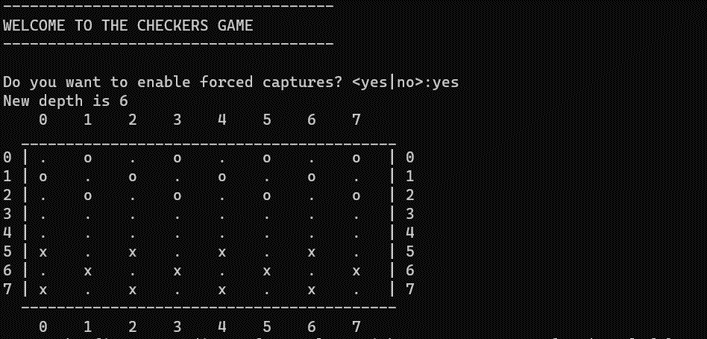
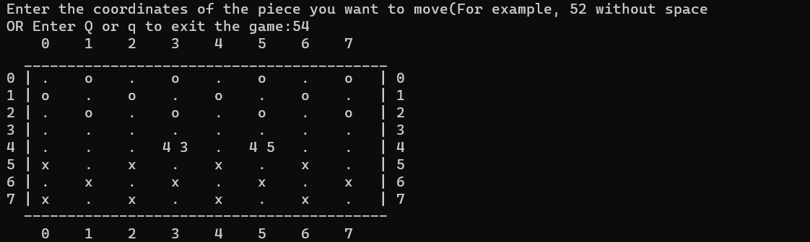
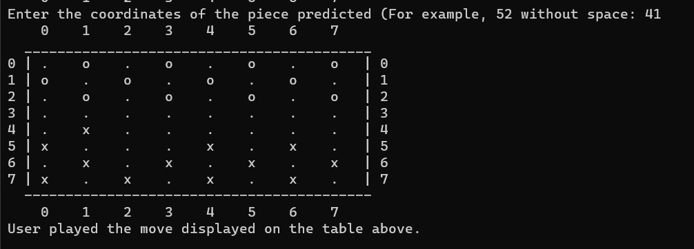
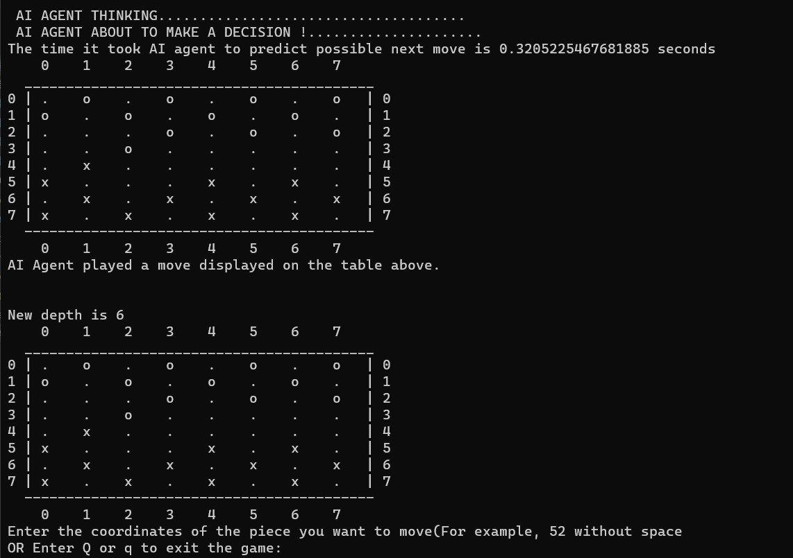

# Alpha Beta Pruning in Checkers - Artificial Intelligence
## Alpha Beta Pruning in Checkers Game

## About Checkers Game
This is an official link to the [Checkers game](https://www.officialgamerules.org/checkers) to help interested individuals understand fundamentally the rules of the game.

## Implementation Design
|  Python Module  | Description |
| --- | --- | 
| `input.py` | Contains helper functions that take input from human player on choice of piece to move. | 
| `position.py` | Contains the position class which captures the state of the Human player & AI Agent pieces on the checker’s board | 
| `game.py` | This module will be the main class that will manage the game | 
| `output.py` | Responsible for printing the state of the board after each turn of the respective players |

## Steps: How to play the Checkers Game
- Step 1: This game is run by executing the `game.py` module using the command `python game.py`.
When the command is run, the interface below is displayed

- Step 2: Human player selects a piece `x` at random to be moved by entering the coordinates `x ` and `y `.
> Example, `(xy)=(52)` where `x ` is 5 and `y` is 2 

- Step 3: AI predicts valid moves for the chosen piece and displays corresponding legitimate moves/position and ask Human Player to choose the location suggested. Human player chooses one of the locations and turn is transfered to the AI Agent.

- Step 4: AI agent plays its own move using the alpha-beta pruning algorithm and computes the time taken to make the decision. The turn is passed to the Human Player again.

